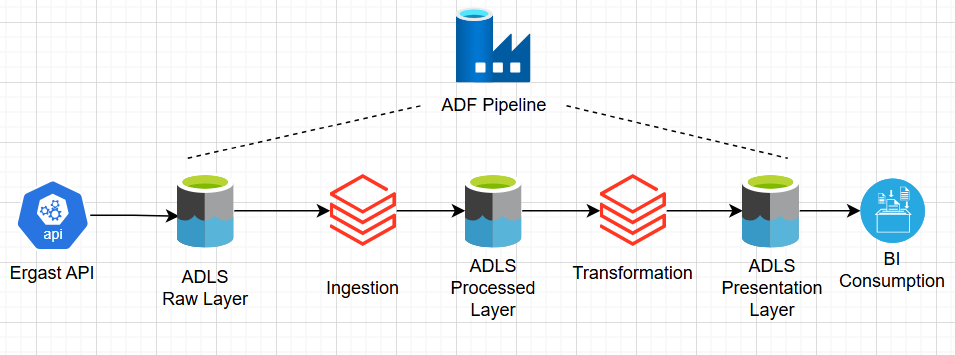
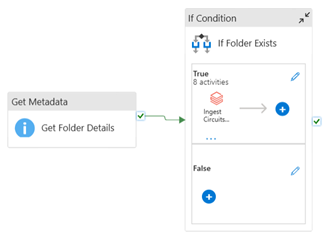
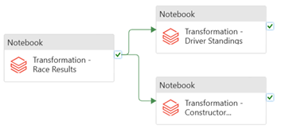
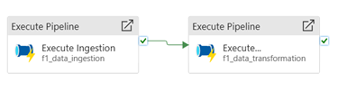

# 🏎️ Formula 1 Cloud Data Platform

A project built using Formula 1 racing data to demonstrate cloud data pipeline concepts and structured analytical modeling.

---

## 📌 Context: Formula 1 Summary

Formula 1 is a global motorsport championship where races occur across circuits worldwide.  
Each season consists of multiple races (not necessarily every week).  
There are **10 constructor teams**, each with **2 drivers**.  

A race weekend includes:
- Three qualifying sessions
- One main race

Races consist of laps, and pit stops occur periodically.  
Positions at the end of qualifying and race sessions determine official results.  
Driver and Constructor standings are awarded based on cumulative points across the season.

---

## 📁 Source Data

### Data Source
- Ingested via **Ergast API**
- Stored in folders named by race date (e.g., `2021-03-21`)
- New folders appear at most weekly

### File Inputs

| File Type | Format | Structure |
|-----------|--------|-----------|
| Circuits | CSV | Single file |
| Races | CSV | Single file |
| Constructors | JSON | Single-line |
| Drivers | JSON | Single-line nested |
| Results | JSON | Single-line |
| PitStops | JSON | Multi-line |
| LapTimes | CSV | Split into multiple files |
| Qualifying | JSON | Split multi-line |

---

## 🏗️ Entities

| Entity | Description |
|--------|------------|
| Circuits | Race track locations and metadata |
| Races | Individual race events mapped to race circuits |
| Constructors | The 10 official Formula 1 teams |
| Drivers | Registered drivers competing for constructors |
| Results | Driver finishing positions and points awarded |
| PitStops | Time and sequence of pitstops during a race |
| LapTimes | Timing for each lap completed |
| Qualifying | Results from qualifying sessions before each race |

---

## 🧩 Entity Relationship Diagram

## 🚀 Purpose

This project organizes and processes raw Formula 1 racing data into structured, analytical-ready components to support reporting, analysis, and future feature expansion.

---

## 📦 Ingestion Requirements

- Ingest all 8 files into the Data Lake  
- Apply schema  
- Add audit columns:  
  - `ingestion_timestamp`  
  - `file_date`

### Ingestion Scenario

| File Group | Behavior | Approach |
|------------|----------|----------|
| Circuits, Races, Constructors, Drivers | Generally pre-determined and independent of the race itself for the season | Full load each week |
| Results, PitStops, LapTimes, Qualifying | Incrementally updated at the end of each race | Spark `partitionOverwrite` mode considered, but does not fully support partial partition updates → use Delta table merge pattern (`whenMatchedUpdate`, `whenNotMatchedInsert`) |

## 🔄 Transformation Requirements

- Generate:
  - Race Results
  - Driver Standings
  - Constructor Standings  
  for each file updated in the raw layer.

### Logic

- **Race Results**
  - Derived from: results, races, circuits, drivers, and constructors.
  - Since results update incrementally, filter the latest file’s `race_date` from the complete `race_results` in the raw layer and join with full data in the raw layer for other files.
  - Incremental grain: `race_id`.

- **Driver Standings**
  - Computed from Race Results.
  - Standings are season-based (`year`), so detect the distinct race years updated in the latest delta `race_results` and recompute standings only for those years.
  - Incremental grain: `race_year`.

- **Constructor Standings**
  - Same approach as driver standings.
  - Incremental grain: `race_year`.

---

## 🧩 Solution Architecture

---

## 🧭 Project Steps

- Ingest data into ADLS Gen2 storage

  - Create Storage Account and containers: `raw`, `processed`, `presentation`
  - Create Databricks Workspace
  - Use Storage Access Key for accessing data lake in the Databricks cluster
  - Define secret scope within Azure Key Vault
  - Use cluster-scoped authentication via Databricks-backed secret scope
  - Register raw layer with Hive Metastore using `CREATE DATABASE` commands  
    *(DBFS mount not used since it requires Entra ID, not available in Student Subscription at the time of creation)*

- Use Databricks Workflow to orchestrate:
  - Ingestion of each file from raw → processed layer
  - Transformation of each file from processed → presentation layer

- Use Databricks Job to orchestrate the complete workflow

- For production workloads, use Azure Data Factory as the fully managed, serverless data ingestion, transformation, and orchestration service.

### Ingestion (ADF)

- Define notebook activities for each file:
  - Create linked service for compute
  - Specify notebook path
  - Use pipeline variables and parameters to define runtime arguments for Databricks notebooks (passed through `dbutils.widgets`)

- Handle file date logic:
  - Use `Get Metadata` activity
  - Use dataset, folder path, and file dates as pipeline parameters
  - Create linked service for storage
  - Pass output folder details into an `If` condition  
    - If folder exists = **True**, execute notebook activities

### Transformation (ADF)

- Define notebook activities
- Configure dependencies so driver and constructor standings execute only after race results are computed
- Pass `file_date` as a pipeline parameter

### Final Orchestration

- Define a master pipeline executing ingestion and transformation pipelines
- Add a tumbling window trigger (runs on a schedule, recurring every 7 days)
- Execute trigger for:
  - Backfilling historical batches
  - Running future batches

## 🧩 Azure Data Factory Mock Pipeline

